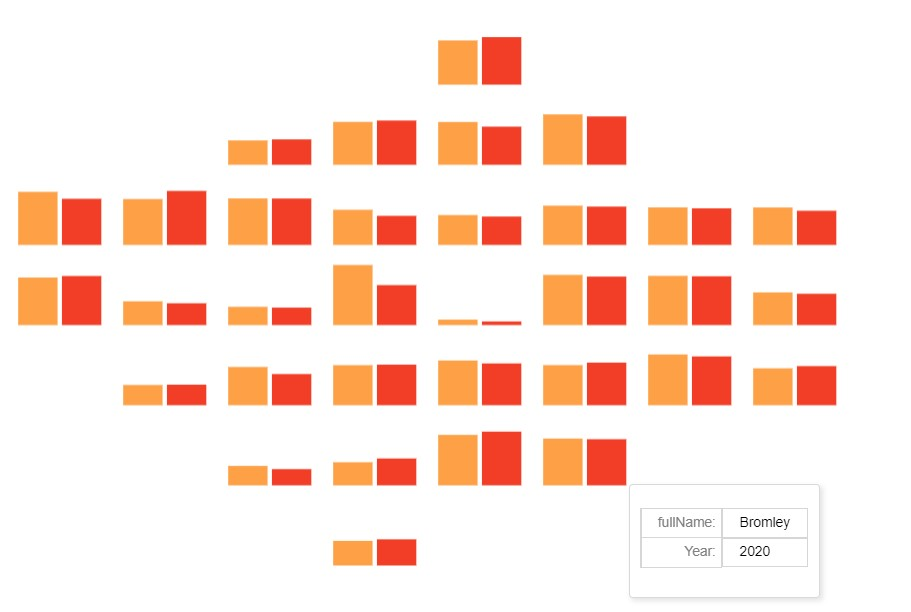

@import "../lectures/css/datavis.less"

```elm {l=hidden}
import Tidy exposing (..)
import VegaLite exposing (..)
```

# Data Visualization: Spatio-temporal Fire Risk Analysis of London

#### Nazia Ferdause Sodial

**Note: It is best to view this file in Litvis. However, for GitHub the screenshots of the visualisations has been loaded in the file.**

Fire is a very critical risk that poses threat to mankind. It contributes to both human and economic losses. In this project, the fire risk in London city is analyzed. London has a strong historic connection to fire known as The Great Fire of London. It led to the path of overwhelming social and economic disasters. Carrying this history along with a diverse spectrum of architecture and building styles, both old and new, as well as a large social and cultural diversity of residents, London like any other international city experiences several fire incidents (P.G Holborn, 2003). These fire incidents must be analyzed to prevent loss of lives, insurance claims, and national/individual costs. In this project, the below research questions will be explored.

- What is the daily and weekly pattern of fire incidents in London? Did the lockdown in 2020 contribute to these patterns?
- What is the seasonality of fire incidents?
- What is the risk distribution of fire incidents across London?

To answer these questions, the dataset is collected from the London datastore to understand the patterns for the years 2019 and 2020. These questions could have been answered using clustering from the unsupervised learning technique. However, clustering is quite a complex methodology, and data visualization can help analyze the data with much ease. Furthermore, the hypothesis is that the number of fire incidents will increase during lockdown due to increase in indoor and outdoor activities of households.

**Visualisation 1 (Viz-1)**:


```elm {l=hidden}
gitPath : String
gitPath =
    "https://NaziaSodial.github.io/DVdata/"
```

```elm {v interactive highlight=8}
calendarPlot : Spec
calendarPlot =
    let
        data =
            dataFromUrl (gitPath ++ "LondonFireBridageDataset.csv") []

        cfg =
            configure
                << configuration (coView [ vicoStroke Nothing ])
                << configuration (coAxis [ axcoDomain False ])

        enc =
            encoding
                << position X
                    [ pName "DateTime"
                    , pOrdinal
                    , pTimeUnit hours
                    , pAxis [ axTitle "hours", axLabelAngle 0, axFormat "%H" ]
                    ]
                << position Y
                    [ pName "DateTime"
                    , pOrdinal
                    , pTimeUnit day
                    , pAxis [ axTitle "" ]
                    ]
                << color
                    [ mName "countTimestamp"
                    , mQuant
                    , mAggregate opCount
                    , mScale [ scScheme "darkred" [ 1, 0 ] ]
                    , mTitle ""
                    ]
    in
    toVegaLite
        [ width 400
        , height 600
        , title "Hourly/Daily pattern of fire incidents in London (2019-2020)" []
        , cfg []
        , data
        , enc []
        , rect [maTooltip ttEncoding]
        ]
```

**Visualisation 2 (Viz-2)**:


_Plot (a)_: Temporal pattern of fire incidents in 2019 and 2020

```elm {v}
barsByClass : Spec
barsByClass =
    let
        data =
            dataFromUrl (gitPath ++ "LondonFireBridageDataset.csv") []

        enc =
            encoding
                << position X
                    [ pName "DateOfCall",pTemporal
                    , pAxis [ axTitle "", axLabelAngle 0, axTicks False]
                    ]
                << position Y [ pAggregate opCount, pTitle "Number of fire incidents" ]

    in
    toVegaLite [ width 800, data, enc [], area [ maFillGradient grLinear
                [ grX1 1
                , grY1 1
                , grX2 1
                , grY2 0
                , grStops [ ( 0, "yellow" ), ( 1, "red" )]
                ]
            ] ]
```

_Plot (b)_: Superposition of average temperature of each day on area chart of the number of fire incidents in 2019 and 2020

```elm {v}
tempfire : Spec
tempfire =
    let

        w =
            100

        h =
            w * 2 / 3
        data1 =
            dataFromUrl (gitPath ++ "Tidy_temperature_and_fire.csv") []


        encDate =
            encoding
                << position X [ pName "Date", pTemporal, pTitle "" ]

        enc1 =
            encoding
                << position Y
                    [ pName "Sum of Number of occurrence"
                    , pQuant, pAxis [ axTitle "Number of fire incidents", axLabelAngle 0, axTicks False]
                    ]

        spec1 =
            asSpec [ enc1 [], area [ maFillGradient grLinear
                [ grX1 1
                , grY1 1
                , grX2 1
                , grY2 0
                , grStops [ ( 0, "yellow" ), ( 1, "red" )]
                ] ] ]

        enc2 =
            encoding
                << position Y
                    [ pName "Avg_Temp"
                    , pQuant
                    , pAxis [ axTitle "Average temperature",axLabelColor "black", axTitleColor "black" ]
                    ]

        spec2 =
            asSpec [ enc2 [], line [ maColor "black" ] ]

        res =
            resolve
                << resolution (reScale [ ( chY, reIndependent ) ])

    in
    toVegaLite [ width 800, data1, res [], encDate [], layer [ spec1, spec2 ] ]
```

**Visualisation 3 (Viz-3)**: Interactive temporal graph of all the different types of fire


```elm {l=hidden highlight=[21-24,26-29]}
firetypeData =
    dataFromUrl (gitPath ++ "LondonFireBridageDataset.csv") []


fireColours =
    categoricalDomainMap
        [ ( "Primary Fire", "#800000" )
        , ( "Secondary Fire", "#FF0000" )
        , ( "Chimney Fire", "#4B0082" )
        , ( "Late Call", "#7FFF00" )
        ]


encHighlight =
    encoding
        << position X
                    [ pName "DateOfCall",pTemporal
                    , pAxis [ axTitle "", axLabelAngle 0, axTicks False ]
                    ]
        << position Y [ pAggregate opCount, pTitle "Number of fire incidents" ]
        << color
            [ mCondition (prParamEmpty "mySelection")
                [ mName "StopCodeDescription", mScale fireColours ]
                [ mStr "black" ]
            ]
        << opacity
            [ mCondition (prParamEmpty "mySelection")
                [ mNum 1 ]
                [ mNum 0.1 ]
            ]
```

```elm {l=hidden v interactive highlight=[7,8-18]}
selRadio : Spec
selRadio =
    let
        ps =
            params
                << param "mySelection"
                    [ paBind
                        (ipRadio
                            [ inName "Type of fire"
                            , inOptions
                                [ "Primary Fire"
                                , "Secondary Fire"
                                , "Chimney Fire"
                                , "Late Call"
                                ]
                            ]
                        )
                    , paSelect sePoint [ seFields [ "StopCodeDescription" ] ]
                    ]
    in
    toVegaLite
        [ width 800
        , firetypeData
        , ps []
        , encHighlight []
        , line []
        ]
```

**Visualisation 4 (Viz-4)**: Grid view of London depicting the Spatio-temporal patterns of 2019 and 2020



```elm {l=hidden}
fireTable : Table
fireTable =
    """
Borough_Code,Year,Number of occurrence
E09000001,2019,78
E09000001,2020,52
E09000002,2019,469
E09000002,2020,450
E09000003,2019,616
E09000003,2020,636
E09000004,2019,530
E09000004,2020,562
E09000005,2019,668
E09000005,2020,667
E09000006,2019,672
E09000006,2020,663
E09000007,2019,505
E09000007,2020,418
E09000008,2019,725
E09000008,2020,772
E09000009,2019,659
E09000009,2020,776
E09000010,2019,635
E09000010,2020,683
E09000011,2019,729
E09000011,2020,701
E09000012,2019,564
E09000012,2020,551
E09000013,2019,341
E09000013,2020,313
E09000014,2019,615
E09000014,2020,548
E09000015,2019,350
E09000015,2020,365
E09000016,2019,538
E09000016,2020,491
E09000017,2019,763
E09000017,2020,663
E09000018,2019,683
E09000018,2020,705
E09000019,2019,429
E09000019,2020,408
E09000020,2019,262
E09000020,2020,251
E09000021,2019,279
E09000021,2020,233
E09000022,2019,575
E09000022,2020,583
E09000023,2019,576
E09000023,2020,612
E09000024,2019,332
E09000024,2020,386
E09000025,2019,707
E09000025,2020,701
E09000026,2019,539
E09000026,2020,526
E09000027,2019,290
E09000027,2020,295
E09000028,2019,642
E09000028,2020,600
E09000029,2019,354
E09000029,2020,376
E09000030,2019,721
E09000030,2020,697
E09000031,2019,724
E09000031,2020,695
E09000032,2019,549
E09000032,2020,448
E09000033,2019,863
E09000033,2020,574
"""
        |> fromCSV
```

```elm {v interactive}
fireOccurenceMap : Spec
fireOccurenceMap =
    let
        gSize =
            140

        border =
            gSize / 10

        w =
            100

        h =
            w * 2 / 3


        fireData =
            dataFromColumns [ parse [ ( "Year", foDate "%Y" ) ] ]
                << dataColumn "Borough_Code" (strColumn "Borough_Code" fireTable |> strs)
                << dataColumn "Number of occurrence" (numColumn "Number of occurrence" fireTable |> nums)
                << dataColumn "Year" (numColumn "Year" fireTable |> nums)

        gridData =
            dataFromUrl "https://gicentre.github.io/data/geoTutorials/londonCentroidsAndGrid.csv" []

        trans =
            transform
                << lookup "Borough_Code"
                    gridData
                    "GSSCode"
                    (luFields [ "gridCol", "gridRow", "fullName"])


        encfire =
            encoding
                << position X [ pName "Year", pOrdinal, pAxis [] ]
                << position Y [ pName "Number of occurrence", pQuant, pAxis [] ]
                << color [ mName"Year", mScale [ scScheme "yelloworangered" [] ] , mLegend []]
                << row [ fName "gridRow", fHeader [ hdTitle "" ] ]
                << column [ fName "gridCol", fHeader [ hdTitle "" ] ]
                << tooltips [ [ tName "fullName"], [ tName "Year", tTemporal, tFormat "%Y" ] ]


        cfg =
            configure
                << configuration (coView [ vicoStroke Nothing ])
                << configuration (coHeader [ hdLabelFontSize 0.1 ])
                << configuration (coFacet [ facoSpacing border ])
    in
    toVegaLite
        [ width 70
        , height 50
        , cfg []
        , fireData []
        , trans []
        , bar [maTooltip ttEncoding]
        , encfire []
        ]
```

#### DATA:

The [London fire bridage incident record](https://data.london.gov.uk/dataset/london-fire-brigade-incident-records) dataset for 2019 and 2020 was obtained from the London datastore. The csv file had data of different incidents over several years. However, the dataset was further cleansed to filter out the fire incidents of 2019 and 2020. The dataset has 35384 records of fire incidents. The below columns were considered for this project:

- Date and time of call: The date and time of the call made to the London fire brigade to report a fire incident.
- Borough code: The borough code of each borough of London city.
- Stop Code Description: This column consists of the types of fire.

As per [Fire statistics definition](https://assets.publishing.service.gov.uk/government/uploads/system/uploads/attachment_data/file/610453/fire-statistics-definitions.pdf), below are the definitions of the different types of fire:

1. Primary fire - serious fire that cause damage to human and property.
2. Secondary fire - small outdoor fires that doesn't involve people or property.
3. Chimney fire - where flames were contained within chimney structures.
4. Late call fire - FRS attended estinguished fire.

For further analysis, the average temperature of London was collected from [Kaggle](https://www.kaggle.com/datasets/sudalairajkumar/daily-temperature-of-major-cities).

This project was structured around Wilkinson's Grammar of Graphics system. The first method of GoG system is to convert the table data into varset. Since the dataset wasn’t tidy, for each visualization design the data was shaped as per the requirement. For Viz-1 and 2(a), the data was scrubbed in an excel sheet. For Viz- 2(b) the daily temperature of London for the year 2019 was merged with the fire incidents data in an excel sheet. The missing values of the average temperature of London were replaced by mean values. This analysis would have benefited if the daily temperatures of 2020 could have been obtained. Unfortunately, the dataset didn't have any values after May 2020. Hence, the daily temperature of the year 2020 was dropped from the excel sheet. For Viz-4, the data was converted to the tidy data format in an excel sheet and then pasted into the litvis document.
Since Elm-Vega-lite is designed using GoG system, all the visualization designs were designed around this system as well.

#### INSIGHTS:

#### Insight one (Viz - 1 and 3)

To visualize hourly and daily patterns, one of the best approaches is to use a calendar view heatmap. Heatmaps have the advantage of graphically encoding quantitative data with colour utilizing small area marks, making them ideal for delivering high-information-density overviews (Munzner,T.,2015). It displays that fire incidents are minimum from 1 am to 9 am which implies the time of the day when most of the population is asleep. It reduces even more between 4 am to 6 am. This very well explains that fire incidents are caused mainly due to human activities. To support this analysis, it can be observed in the calendar plot as the human activities increase from morning to evening, the fire incidents also increase. The peak in fire incidents occurs from 6 pm to 7 pm. The rise in human activities owing to the end of working hours could be one of the factors. The other contributing factor could be chimney fire. However, from the interactive visualization plot of different types of fire, Viz-3 it can be concluded that chimney fire doesn’t contribute much to daily fire incident patterns.
Fire incidents seem uniform across all the days of the week. Although on weekends, fire incidents stretch past midnight as well. This insight sheds light on the fact that human activities majorly contribute to fire incidents. This insight very well answers the first part of the first research question.

#### Insight two (Viz - 2 and 3)

The area chart (Viz -2, plot a) of the fire incidents has the dates of the incidents (2019 - 2020) along the X-axis and the number of fire incidents along the Y-axis. This graph is bimodal and the peaks are observed from May to September in both the years. However, June 2020 seems to be an outlier. Additionally, the number of fire incidents in the 2020 summer is comparatively high. One of the reasons could be the nationwide lockdown. The Viz-3 was used to identify which type of fire was the major contributor to this spike. Turns out secondary fire i.e. outdoor fire is the major contributor to this spike. As per [London Fire Brigade](https://www.london-fire.gov.uk/news/2020-news/april/london-lockdown-sees-spike-in-outdoor-fires/) the spike in the outdoor fire in 2020 was due to bonfires coinciding with warmer weather. Since most the people were at home, a lot of waste resulted due to cleaning and gardening. These activities resulted in fire incidents from bonfires. This answers the second part of the first research question as well as accept the hypothesis.

Further, the average temperature of each day of 2019 was superimposed on the area graph to verify if the rise in fire incidents in summer is a coincidence or due to a rise in temperature. The Viz-2, plot (b) strongly supports this conclusion that fire incidents are impacted by seasons of the year and summer faces the highest number of fire incidents. This answers the second research question.

#### Insight three (Viz - 4)

To analyze the fire risk distribution across London from 2019 to 2020, a Spatio-temporal design was developed. The Viz-4 is a simplified version of the geographic map of London where each borough is represented in the shape of a grid. The temporal aspect was represented by two bars where orange represented 2019 and red represented 2020.
Surprisingly, the risk distribution seems uniform across London. The City of London borough has the least number of fire incidents in these two years. Whereas, Westminister faced the highest number of fire incidents in 2019. Comparatively, the fire risk distribution in the east of London seems uniform compared to the west, north and south of London. This insight answers the third research question but raises a major concern that despite 2019 facing a high number of fire incidents there doesn't seem to be any change in the pattern in 2020. The results of Viz - 3 further add criticality to this concern as there doesn't seem to be any decrease in the primary fire with time. This is quite alarming as it seems like no measures were taken to mitigate the risks.

#### DESIGN JUSTIFICATIONS:

Colour:
As mentioned in Rost, L-C. (2018) Your friendly guide to colors in data visualization. Datawrapper blog, colour enables visual designers to tell a story. In this project, colour plays a significant role in connecting “The Great Fire of London” which was one of the darkest times in London to the increase in fire incidents during another darkest time in history which is the covid-19 pandemic.
**Visualization 1 and 4:** YellowOrangeRed which is a sequential multi hue scheme was used in both calendar plot and temporal-spatial visualization as hue is an identity channel. In agreement with Munzner, T. hue is extremely useful in identifying patterns or clusters for categorical data. This hue was used to replicate the original colour and texture of fire and its intensity. Also, hue is extremely effective for spatial position and makes a fine distinction for the contiguous region (Munzner, T.,2015). This hue was used to resemble the intensity of fire to the severity of the increase in fire incidents. In the calendar plot, maximum fire incidents happen from 6 pm to 7 pm which turned into an almost blackish-red colour due to extremely high value signifying the darkest hour of the day. In the temporal-spatial design (Viz-4), red was chosen for 2020 data and orange for 2019 data because fire occurrences during the pandemic would have had a greater impact than pre-pandemic times because London city was already dealing with the social and economic turmoil caused by covid-19.
**Visualization 2:** Similarly, the aim of using red colour in the temporal area chart with yellow gradient fill was to display the plot as fire. The area chart with gradient fill was inspired from the gallery of Vega-lite. Again, in this plot as the number of incidents got higher the colour turned red indicating the criticality of the situation.
**Visualization 3:** In Viz – 3, the interactive plot focuses more on the types of fire than the temporal data. Since types of fire data are nominal, distinct and distinguishable categorical colours were used using hexadecimal color codes from the w3school colour palette.

A colour blind test was performed on this project’s designs using coblis. Although the shades change for red and green weak, the designs aren’t misleading as the hues help identify the temporal patterns and spatial risk distribution.

Layout:
**Visualization 1:** Even ordinary phrases like time and date can be used to partially identify the temporal scale of interest. Finding or validating periodicity on a pre-set scale or on a scale that is unknown in advance is a common problem in temporal analysis (Munzner, T.,2015). Calendar heatmap proved to be the layout choice for Viz-1 as the data has two categorical attributes - hours and days with one quantitative attribute which is the number of fire incidents as per Munzner,T. a 2D matrix is the best way to identify clusters or patterns. The idea was to create an interactive calendar view heatmap for Viz-1but due to Elm skill limitations a simplified calendar view heatmap was created. This layout correctly depicted a time-series heatmap displaying the cyclic patterns of hourly fire incidents in a week.
**Visualization 2:** Temperature rise in London city in 2019 is one visual layer and the area chart of the number of fire incidents in London in 2019 is another visual layer. The alignment of the simple constituent drawings is uncomplicated, as proposed by Munzner, because they are all superimposed right on top of each other so that they share the same frame. Hence, to compare the dependency of fire incidents with temperature rise, one of the best design approaches is superposition. Despite temperature and fire incidents having different scales, it was possible to find the relation between these two variables and derive conclusions.
**Visualization 3:** In Viz-3, temporal juxtaposition helped to keep a fixed baseline to visualize the trends of different types of fire incidents. With the help of interaction, the types of fire could be compared based on the same scale. This made the comparison very easy and it could be easily concluded that fire incidents due to chimneys and late calls are negligible. Also, it was easier to compare the fluctuations of secondary fire with primary fire.
**Visualization 4:** Location is a very important visual variable and the London fire incident dataset consisted of the location of the fire incidents. To explore the third research question, the exact layout of each borough wasn’t necessary but the spatial proximity is important to imply the association of fire risks across London. So, one of the minimalist approaches to visualize Spatio-temporal design was to use the grid arrangement of London boroughs was designed by [After The Flood](https://aftertheflood.com/projects/future-cities-catapult/) where each borough gets the same amount of space, and the grid alignment makes it easier to compare values across rows and columns. As per the initial sketch (Viz 5), the idea was to visualize London's boroughs as blocks of fire by stacking the area chart of 2020 on the area chart of 2019. However, while developing the design it was observed that this design approach is quite complex, and to answer the third research question the monthly pattern was unnecessary. So, in Viz 4, a simple grid arrangement of London boroughs is layered with bar plots of total fire incidents of 2019 and 2020. This helped to identify clusters of similar attributes. This design also supports the “first law of geography” by Waldo Tobler, “Everything is related to everything else, but near things are more related than distant things”.

Interaction:
To answer the research questions, it was important to dig deep into the data and find the hidden patterns. This would result in generating several plots by sub-setting the data with different temporal aspects and boroughs of London. This could be simplified by embracing interaction between the user and graphical representation. As rightly mentioned in Wilkinson's Grammar of Graphics, any activities in visualization would be faced by the user, not the visualization designer. So creating a user-friendly yet effective interaction in the visualization designs is very important. This design choice was inspired by the two processes: (a) making a selection and (b) responding to the selection summarized in the grammar of interaction, Satyanarayan et al (2017).
**Visualization 1:** By hovering the mouse over the selected parts in Viz-1, interaction assisted in making a selection of the high or low-intensity areas. Simple user interaction was used in these two designs to convey extra information about the selected portion.
**Visualization 3:** The addition of radio buttons to Viz-3 helped to filter out inconsequential types of fire, allowing to select the critical fire types and then identify the fluctuations in the pattern. This interaction simplified the method of identifying the correlation between the impact of covid-19 lockdown and the secondary fire type.
**Visualization 4:** In this design, interaction played a very vital role in keeping the design minimal as suggested by Tufte. Simple hovering of the mouse on the grids helps the user identify the boroughs as well as the year of the bars. Due to the addition of interaction no legends of the years or boroughs were required.

#### REFERENCES:

**P.G. Holborna, P.F. Nolana, J. Golt** (2003) [An analysis of fatal unintentional dwelling fires investigated by London Fire Brigade between 1996 and 2000](https://www.sciencedirect.com/science/article/pii/S0379711202000498)

**LBF** , Available at [https://data.london.gov.uk/dataset/london-fire-brigade-incident-records](https://data.london.gov.uk/dataset/london-fire-brigade-incident-records)

**Kaggle Dataset**, Available at [https://www.kaggle.com/datasets/sudalairajkumar/daily-temperature-of-major-cities](https://www.kaggle.com/datasets/sudalairajkumar/daily-temperature-of-major-cities)

**Fire statistics definition**, Available at [https://assets.publishing.service.gov.uk/government/uploads/system/uploads/attachment_data/file/610453/fire-statistics-definitions.pdf](https://assets.publishing.service.gov.uk/government/uploads/system/uploads/attachment_data/file/610453/fire-statistics-definitions.pdf)

**Wilkinson, L.** (2010) [The Grammar of Graphics: Wiley interdisciplinary reviews](https://go.exlibris.link/2pPxZX51). _Computational Statistics_, 2010 (2), pp.673–677.

**Munzner, T.** (2015) Chapter 7: _Color and other channels_, pp.218-235 in [Visualization Analysis and Design](https://go.exlibris.link/9jMy6fQG), CRC Press

**Shneiderman, B.** (1996) [The eyes have it: A task by data type taxonomy for information visualization](https://drum.lib.umd.edu/bitstream/handle/1903/5784/TR_96-66.pdf), _Proceedings of the IEEE Symposium on Visual Languages_, pp.336-343.

**Tufte, E.** (2001) [The Visual Display of Quantitative Information](https://go.exlibris.link/HRpwwyBl), Graphics Press.

**Rost, L-C.** (2018) [Your friendly guide to colors in data visualization](https://blog.datawrapper.de/colorguide/). _Datawrapper blog_

**Munzner, T.** (2015) Chapter 10: _Color and other channels_, pp.218-235 in [Visualization Analysis and Design](https://go.exlibris.link/9jMy6fQG), CRC Press

**Satyanarayan, A., Moritz, D., Wongsuphasawat, K. and Heer, J.** (2017) [Vega-Lite: A Grammar of Interactive Graphics](https://files.osf.io/v1/resources/mqzyx/providers/osfstorage/5be5e643d354e900197998bd?action=download&version=1&direct&format=pdf). _IEEE Transactions on Visualization and Computer Graphics,_ 23(1) pp. 341-350.

**Munzner, T.** (2015) Chapter 12: _Color and other channels_, pp.218-235 in [Visualization Analysis and Design](https://go.exlibris.link/9jMy6fQG), CRC Press

**Vega-Lite Gallery**, Available at, [https://vega.github.io/vega-lite/examples/](https://vega.github.io/vega-lite/examples/)

**Hexadecimal Colors**, Available at, [https://www.w3schools.com/colors/colors_hexadecimal.asp?msclkid=898227dac80d11ecaf509facf0569291](https://www.w3schools.com/colors/colors_hexadecimal.asp?msclkid=898227dac80d11ecaf509facf0569291)
